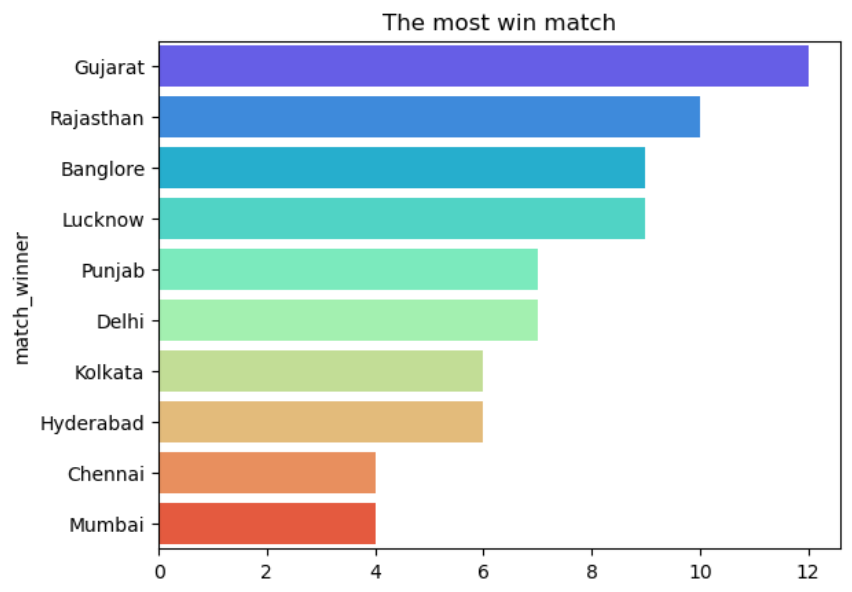
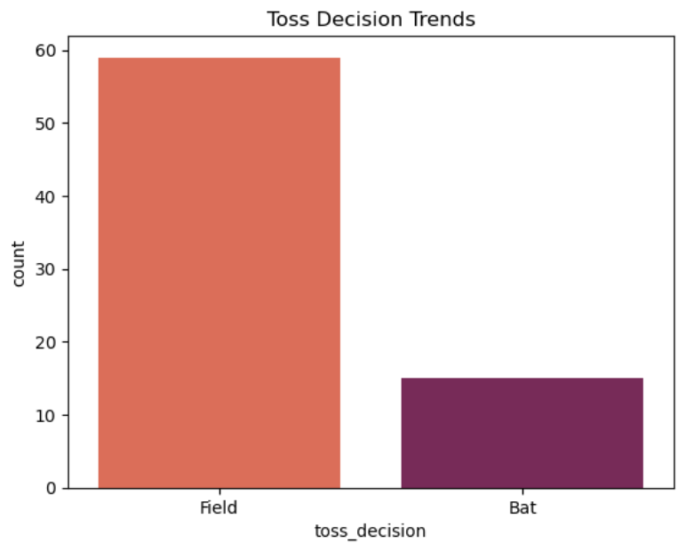
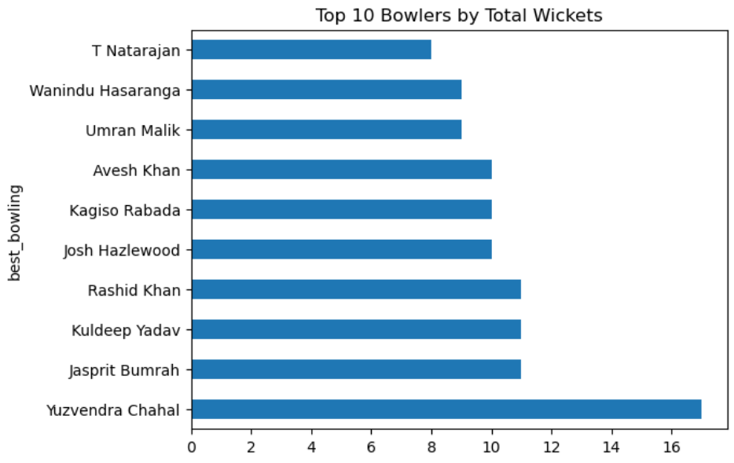
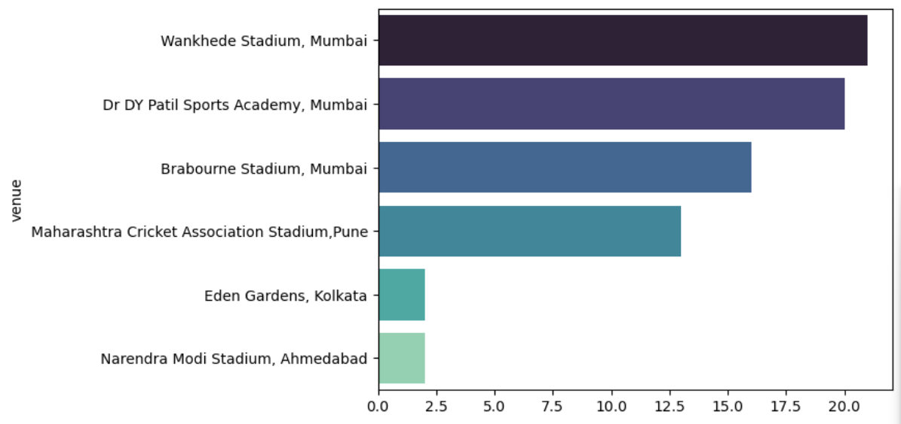

🏏 IPL Data Analysis using Python
📌 Project Overview
This project performs Exploratory Data Analysis (EDA) on the Indian Premier League (IPL) dataset using Python. The analysis focuses on uncovering trends in team performance, player statistics, venue analysis, toss impact, and match outcomes using data visualization techniques.

🎯 Objectives
Clean and preprocess the IPL dataset.
Analyze team performances across seasons.
Study the impact of winning the toss.
Analyze venue-wise match statistics.
Identify top-performing batsmen and bowlers.
Visualize key insights using charts.

🛠️ Technologies Used
Python
Pandas
NumPy
Matplotlib
Jupyter Notebook

📂 Project Structure
IPL-Data-Analysis/
│
├── IPL-Project.ipynb
├── IPL-checkpoint.csv
├── images/
│   ├── team_wins.png
│   ├── toss_analysis.png
│   ├── top_bowlers.png
│   └── venue_analysis.png
└── README.md
|___ requirements.txt

📊 Analysis Performed
The notebook answers questions such as:

Which team has won the most IPL matches?
Does winning the toss improve the chances of winning?
Which venues host the most matches?
Which batsmen have scored the most runs?
Which bowlers have taken the most wickets?
Which venues have the highest average scores?
## 📸 Visualizations

### Team Wins

### Toss Analysis

### Top Bowlers

### Venue Analysis

🚀 How to Run
Clone or download this repository.
Install the required libraries:
pip install pandas numpy matplotlib jupyter
Open IPL_Data_Analysis.ipynb in Jupyter Notebook.
Run all the cells.

📈 Key Insights
-Winning the toss does not guarantee victory.
-Certain venues are more batting friendly. 
-Top performers consistently influence match outcomes. 
-Scoring patterns vary across tournament stages.

👩‍💻 Author
Nisha Kumari
